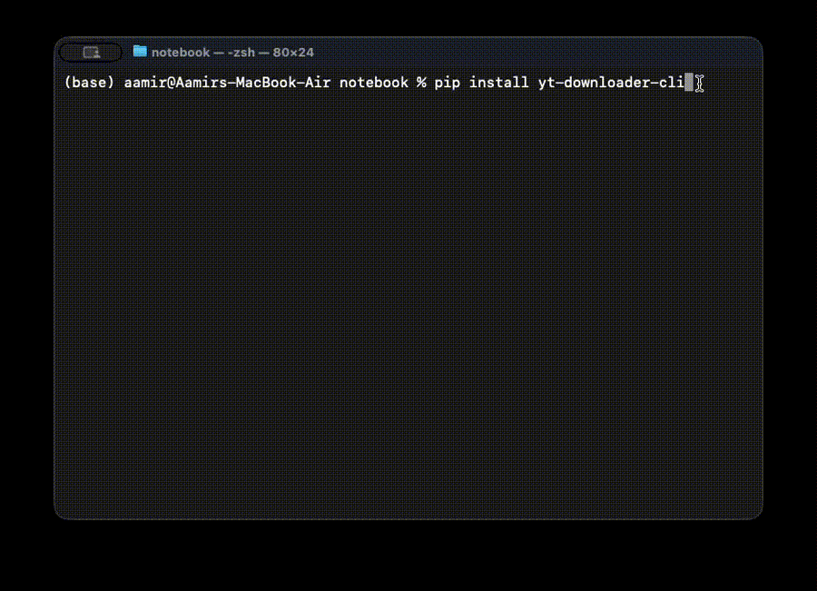

# 🎬 YT Downloader CLI

[](https://pypi.org/project/yt-downloader-cli/)
[](https://pypi.org/project/yt-downloader-cli/)
[](https://github.com/aamirrokz/yt-downloader)
[](https://github.com/aamirrokz/yt-downloader/actions)

A professional, interactive YouTube video and playlist downloader built with **yt-dlp**, packaged for **PyPI**, containerized with **Docker**, and powered by **GitHub Actions CI/CD**.

---

## ✨ Features

* 🎥 Download single videos or full playlists
* 🎚 Select resolution (1080p / 720p / 480p / Best)
* 🎵 Audio-only mode (MP3 extraction)
* 📊 Live progress bar
* 🔁 Input validation & retry logic
* 🐳 Docker support
* 🚀 Automated CI/CD pipeline
* 📦 Published to PyPI with semantic versioning

---
## 🎥 Demo

<p align="center">
  
</p>

---

# 📦 Installation

## 🔹 Install from PyPI (Recommended)

```bash
pip install yt-downloader-cli
```

---

## 🔹 Upgrade to Latest Version

```bash
pip install --upgrade yt-downloader-cli
```

---

## 🔹 Run the CLI

```bash
yt-downloader
```

You’ll see an interactive prompt:

```
🎬 YouTube Downloader CLI Tool
Enter YouTube Video or Playlist URL:
```

---

# 🖥 Example Usage

1. Enter a valid YouTube URL
2. Choose resolution
3. Choose audio-only option
4. Watch progress bar download your media

---

# 🐳 Run with Docker

## Build Image

```bash
docker build -t yt-downloader .
```

## Run Container (Interactive Mode Required)

```bash
docker run -it -v "$PWD":/app yt-downloader
```

---

# 🔧 Development Setup

Clone repository:

```bash
git clone https://github.com/aamirrokz/yt-downloader.git
cd yt-downloader
```

Create virtual environment:

```bash
python -m venv venv
source venv/bin/activate
```

Install dependencies:

```bash
pip install -r requirements.txt
```

Run locally:

```bash
python -m yt_downloader.cli
```

---

# 🚀 Release Process

1. Update version in `pyproject.toml`
2. Commit changes
3. Tag release:

```bash
git tag v1.x.x
git push origin v1.x.x
```

GitHub Actions will automatically:

* Build package
* Publish to PyPI
* Create GitHub Release

---

# 📦 Project Structure

```
yt-downloader/
│
├── yt_downloader/
│   ├── __init__.py
│   └── cli.py
│
├── pyproject.toml
├── Dockerfile
├── README.md
└── .github/workflows/
```

---

# 🛡 Requirements

* Python 3.8+
* FFmpeg (required for merging audio/video)

Install FFmpeg (macOS):

```bash
brew install ffmpeg
```

---

# ⚠ Disclaimer

This tool is for educational and personal use only.
Please ensure you comply with YouTube’s Terms of Service and copyright laws.

---

# 👨‍💻 Author

Built and maintained by **Aamir Contractor**

If you found this useful, ⭐ the repository on GitHub!

---

# 📜 License

MIT License
